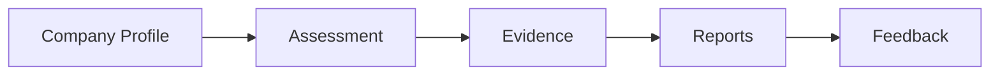
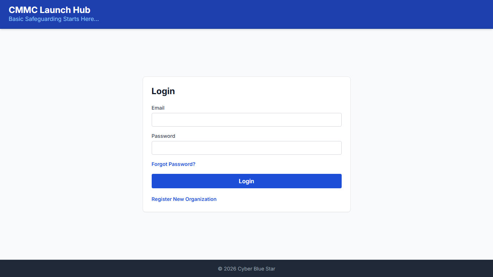
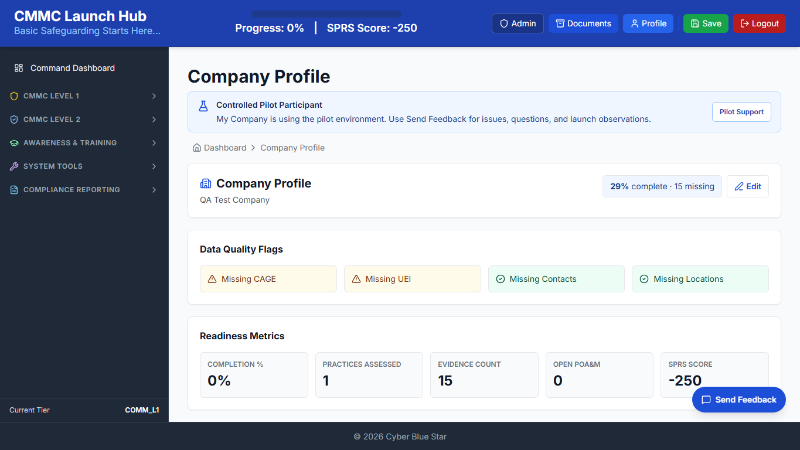
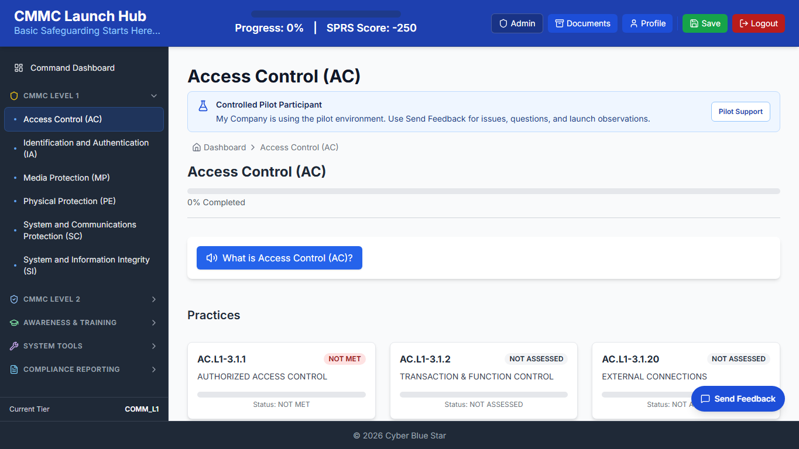
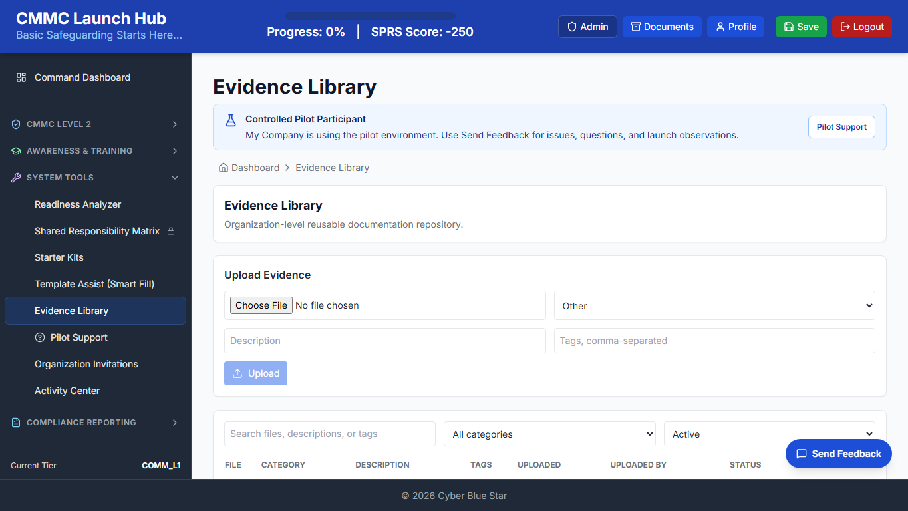
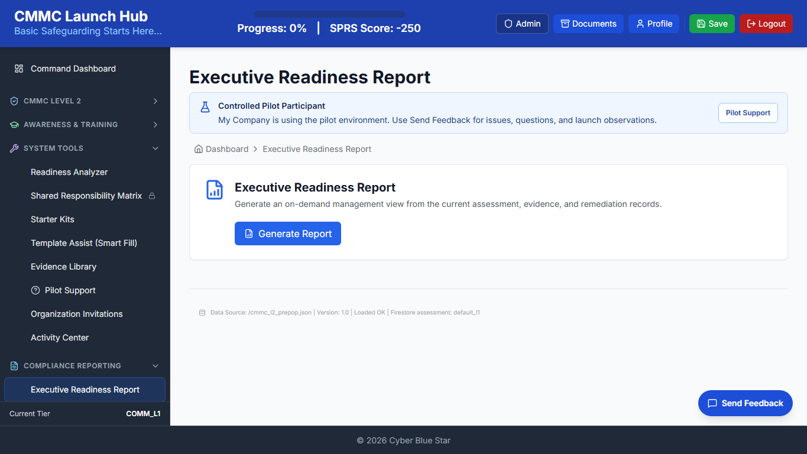
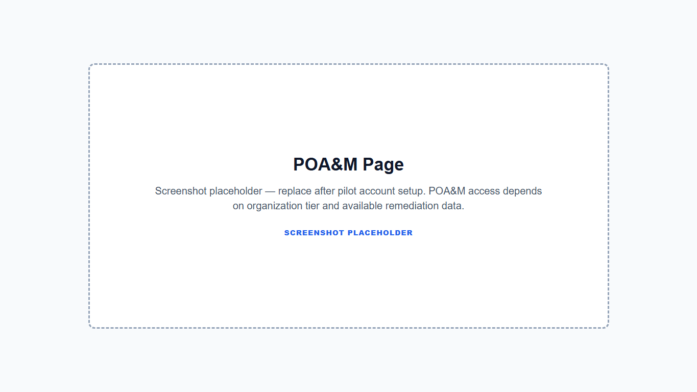
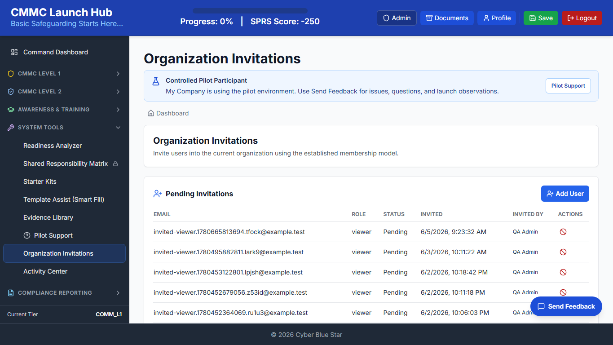
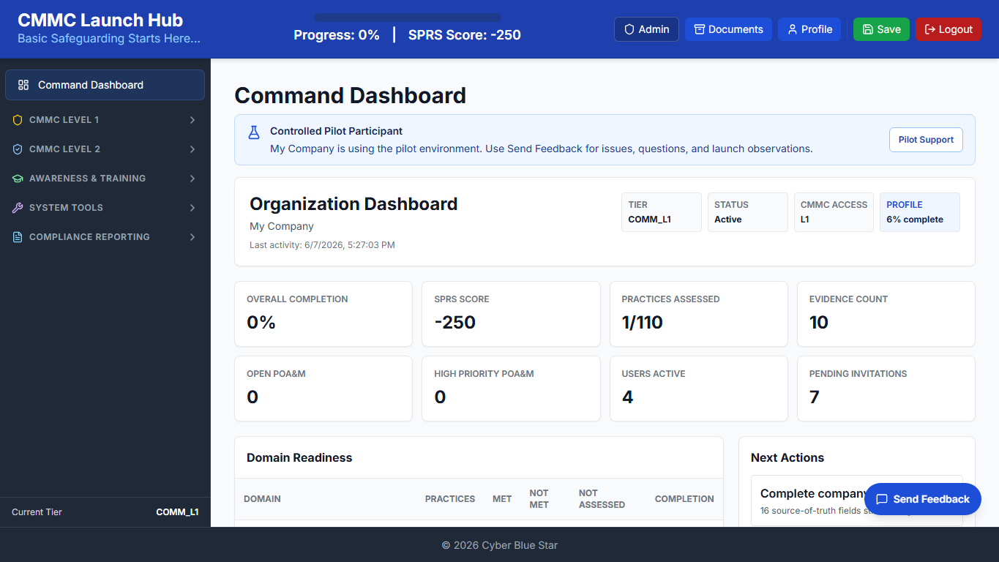

# CMMC Launch Hub Quick Start Guide v1.0

**A 5-7 minute onboarding guide for pilot users**

- Version: v1.0
- Audience: Pilot users, OrgAdmins, Contributors, Assessors, Viewers
- Prepared by: Cyber Blue Star
- Date generated: June 7, 2026

## 1. Welcome to CMMC Launch Hub

CMMC Launch Hub helps organizations assess cybersecurity readiness, manage evidence, coordinate users, and generate pilot-ready reports. It does not certify compliance by itself.

## 2. Typical Workflow

## 3. Step 1: Log In

Use your assigned email and password. Use Forgot Password if needed. Contact your OrgAdmin or pilot support if your account is inactive.

## 4. Step 2: Review Your Organization Dashboard

Review readiness summary, evidence snapshot, report shortcuts, next actions, and recent activity.

## 5. Step 3: Complete Company Profile

Complete legal name, DBA, CAGE, UEI, NAICS, contacts, FCI/CUI handling, locations, and providers. Profile data feeds SSP and reports.

## 6. Step 4: Complete Assessment

Review domains, practices, objectives, status, notes, responsibility, and save progress regularly.

## 7. Step 5: Upload Evidence

Upload current, relevant, organization-specific evidence. OCR/summary may assist but should be reviewed.

## 8. Step 6: Generate Reports

Reports include Executive Readiness Report, SPRS Scorecard, POA&M, SSP if tier allows, and Shared Responsibility Matrix where available.

Note: POA&M management access depends on organization tier and pilot data.

## 9. Collaborating With Your Team

OrgAdmins and OrgOwners can invite users, assign least-privileged roles, and coordinate evidence and assessment work.

## 10. Step 7: Use Feedback and Support

Submit bugs, questions, and improvement ideas frequently during the pilot.

## 11. Roles & Permissions

| Role | What They Can Do |
| --- | --- |
| OrgAdmin / OrgOwner | Manage profile, users, assessment, evidence, reports |
| Contributor | Help complete assessment/evidence |
| Assessor | Review readiness/evidence |
| Viewer | Read-only access |
| SuperAdmin | Platform administration |

## 12. Quick Start Checklist

- [ ] Log in
- [ ] Complete Company Profile
- [ ] Review Organization Dashboard
- [ ] Complete first 5 practices
- [ ] Upload first evidence item
- [ ] Generate Executive Report
- [ ] Submit feedback

## 13. Need Help

For pilot support, use the Support page or Feedback button inside CMMC Launch Hub.
